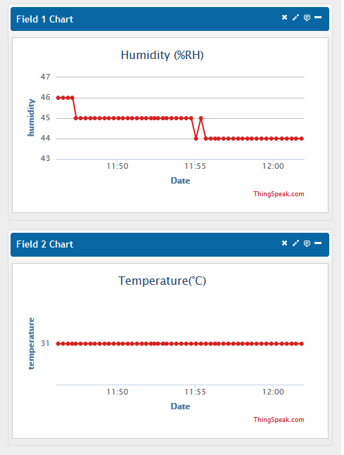

espduino
========

# WARNING: This project discontinue support, 
# if you want to play ESP8266 with arduino, please visit: [Arduino for ESP8266](https://github.com/esp8266/Arduino)

This is Wifi library (Chip ESP8266 Wifi soc) for arduino using SLIP protocol via Serial port

You can found the **Native MQTT client** library for ESP8266 work well here: 
[https://github.com/tuanpmt/esp_mqtt](https://github.com/tuanpmt/esp_mqtt)

Source code bridge for ESP8266 can found here: [https://github.com/tuanpmt/esp_bridge](https://github.com/tuanpmt/esp_bridge)

Features
========
- Rock Solid wifi network client for Arduino/mbed (coming soon)
- **More reliable** than AT COMMAND library (Personal comments)
- **Firmware applications written on ESP8266 can be read out completely. For security applications, sometimes you should use it as a Wifi client (network client) and other MCU with Readout protection.**
- MQTT module: 
    + MQTT client run stable as Native MQTT client (esp_mqtt)
    + Support subscribing, publishing, authentication, will messages, keep alive pings and all 3 QoS levels (it should be a fully functional client).
    + **Support multiple connection (to multiple hosts).**
    + Support SSL
    + Easy to setup and use
- REST module:
    + Support method GET, POST, PUT, DELETE
    + setContent type, set header, set User Agent
    + Easy to used API
    + Support SSL
    + Support multiple connection
    
### To-Do:
- WIFI AP  
- Webserver module
- NTP module
- RTC + Memory
- mDNS module

Installations
========
**1. Clone this project:**

```bash
git clone https://github.com/tuanpmt/espduino
cd espduino
```

**2. Program ESP8266:**

- Wiring: 
- Program release firmware:

```python
esp8266/tools/esptool.py -p COM1 write_flash 0x00000 esp8266/release/0x00000.bin 0x40000 esp8266/release/0x40000.bin
```
    
- Or Program debug firmware (Debug message from ESP8266 will forward to debug port of Arduino)

```python
esp8266/tools/esptool.py -p COM1 write_flash 0x00000 esp8266/debug/0x00000.bin 0x40000 esp8266/debug/0x40000.bin
```

**3. Wiring:**


**4. Import arduino library and run example:**

Example read DHT11 and send to [thingspeak.com](http://thingspeak.com)
=========
- ```espduino/examples/thingspeak/thingspeak.ino```
- Using DHT11 library from: [https://github.com/RobTillaart/Arduino](https://github.com/RobTillaart/Arduino)



Example send pushbullet push notification:
=============
[http://tuanpm.net/pir-motion-detect-send-pushbullet-push-notification-with-esp8266/](http://tuanpm.net/pir-motion-detect-send-pushbullet-push-notification-with-esp8266/)


Example for MQTT client
=======

```c
/**
 * \file
 *       ESP8266 MQTT Bridge example
 * \author
 *       Tuan PM <tuanpm@live.com>
 */
#include <SoftwareSerial.h>
#include <espduino.h>
#include <mqtt.h>

SoftwareSerial debugPort(2, 3); // RX, TX
ESP esp(&Serial, &debugPort, 4);
MQTT mqtt(&esp);
boolean wifiConnected = false;

void wifiCb(void* response)
{
  uint32_t status;
  RESPONSE res(response);

  if(res.getArgc() == 1) {
    res.popArgs((uint8_t*)&status, 4);
    if(status == STATION_GOT_IP) {
      debugPort.println("WIFI CONNECTED");
      mqtt.connect("yourserver.com", 1883, false);
      wifiConnected = true;
      //or mqtt.connect("host", 1883); /*without security ssl*/
    } else {
      wifiConnected = false;
      mqtt.disconnect();
    }
    
  }
}

void mqttConnected(void* response)
{
  debugPort.println("Connected");
  mqtt.subscribe("/topic/0"); //or mqtt.subscribe("topic"); /*with qos = 0*/
  mqtt.subscribe("/topic/1");
  mqtt.subscribe("/topic/2");
  mqtt.publish("/topic/0", "data0");

}
void mqttDisconnected(void* response)
{

}
void mqttData(void* response)
{
  RESPONSE res(response);

  debugPort.print("Received: topic=");
  String topic = res.popString();
  debugPort.println(topic);

  debugPort.print("data=");
  String data = res.popString();
  debugPort.println(data);

}
void mqttPublished(void* response)
{

}
void setup() {
  Serial.begin(19200);
  debugPort.begin(19200);
  esp.enable();
  delay(500);
  esp.reset();
  delay(500);
  while(!esp.ready());

  debugPort.println("ARDUINO: setup mqtt client");
  if(!mqtt.begin("DVES_duino", "admin", "Isb_C4OGD4c3", 120, 1)) {
    debugPort.println("ARDUINO: fail to setup mqtt");
    while(1);
  }


  debugPort.println("ARDUINO: setup mqtt lwt");
  mqtt.lwt("/lwt", "offline", 0, 0); //or mqtt.lwt("/lwt", "offline");

/*setup mqtt events */
  mqtt.connectedCb.attach(&mqttConnected);
  mqtt.disconnectedCb.attach(&mqttDisconnected);
  mqtt.publishedCb.attach(&mqttPublished);
  mqtt.dataCb.attach(&mqttData);

  /*setup wifi*/
  debugPort.println("ARDUINO: setup wifi");
  esp.wifiCb.attach(&wifiCb);

  esp.wifiConnect("DVES_HOME","wifipassword");


  debugPort.println("ARDUINO: system started");
}

void loop() {
  esp.process();
  if(wifiConnected) {

  }
}

```

Example for RESTful client
=====
```c
/**
 * \file
 *       ESP8266 RESTful Bridge example
 * \author
 *       Tuan PM <tuanpm@live.com>
 */

#include <SoftwareSerial.h>
#include <espduino.h>
#include <rest.h>

SoftwareSerial debugPort(2, 3); // RX, TX

ESP esp(&Serial, &debugPort, 4);

REST rest(&esp);

boolean wifiConnected = false;

void wifiCb(void* response)
{
  uint32_t status;
  RESPONSE res(response);

  if(res.getArgc() == 1) {
    res.popArgs((uint8_t*)&status, 4);
    if(status == STATION_GOT_IP) {
      debugPort.println("WIFI CONNECTED");
     
      wifiConnected = true;
    } else {
      wifiConnected = false;
    }
    
  }
}

void setup() {
  Serial.begin(19200);
  debugPort.begin(19200);
  esp.enable();
  delay(500);
  esp.reset();
  delay(500);
  while(!esp.ready());

  debugPort.println("ARDUINO: setup rest client");
  if(!rest.begin("yourapihere-com-r2pgihowjx7x.runscope.net")) {
    debugPort.println("ARDUINO: failed to setup rest client");
    while(1);
  }

  /*setup wifi*/
  debugPort.println("ARDUINO: setup wifi");
  esp.wifiCb.attach(&wifiCb);
  esp.wifiConnect("DVES_HOME","wifipassword");
  debugPort.println("ARDUINO: system started");
}

void loop() {
  char response[266];
  esp.process();
  if(wifiConnected) {
    rest.get("/");
    if(rest.getResponse(response, 266) == HTTP_STATUS_OK){
      debugPort.println("RESPONSE: ");
      debugPort.println(response);
    }
    delay(1000);
  }
}
```

MQTT API:
=======
```c
FP<void, void*> connectedCb;
FP<void, void*> disconnectedCb;
FP<void, void*> publishedCb;
FP<void, void*> dataCb;


MQTT(ESP *esp);
boolean begin(const char* client_id, const char* user, const char* pass, uint16_t keep_alive, boolean clean_seasion);
boolean lwt(const char* topic, const char* message, uint8_t qos, uint8_t retain);
boolean lwt(const char* topic, const char* message);
void connect(const char* host, uint32_t port, boolean security);
void connect(const char* host, uint32_t port);
void disconnect();
void subscribe(const char* topic, uint8_t qos);
void subscribe(const char* topic);
void publish(const char* topic, uint8_t *data, uint8_t len, uint8_t qos, uint8_t retain);
void publish(const char* topic, char* data, uint8_t qos, uint8_t retain);
void publish(const char* topic, char* data);
```

REST API:
==============

```c
REST(ESP *e);
boolean begin(const char* host, uint16_t port, boolean security);
boolean begin(const char* host);
void request(const char* path, const char* method, const char* data);
void request(const char* path, const char* method, const char* data, int len);
void get(const char* path, const char* data);
void get(const char* path);
void post(const char* path, const char* data);
void put(const char* path, const char* data);
void del(const char* path, const char* data);

void setTimeout(uint32_t ms);
uint16_t getResponse(char* data, uint16_t maxLen);
void setUserAgent(const char* value); //setUserAgent("Your user agent"); 
// Set Content-Type Header
void setContentType(const char* value); //setContentType("application/json");
void setHeader(const char* value);//setHeaer("Header1:value1\r\nHeader2:value2\r\n");
```

Authors:
=================
[Tuan PM](https://twitter.com/tuanpmt)


Donations
==================
Invite me to a coffee
[](https://www.paypal.com/cgi-bin/webscr?cmd=_s-xclick&hosted_button_id=JR9RVLFC4GE6J)

LICENSE - "MIT License"
==================
Copyright (c) 2014-2015 [Tuan PM](https://twitter.com/tuanpmt)

Permission is hereby granted, free of charge, to any person obtaining a copy of this software and associated documentation files (the "Software"), to deal in the Software without restriction, including without limitation the rights to use, copy, modify, merge, publish, distribute, sublicense, and/or sell copies of the Software, and to permit persons to whom the Software is furnished to do so, subject to the following conditions:

The above copyright notice and this permission notice shall be included in all copies or substantial portions of the Software.

THE SOFTWARE IS PROVIDED "AS IS", WITHOUT WARRANTY OF ANY KIND, EXPRESS OR IMPLIED, INCLUDING BUT NOT LIMITED TO THE WARRANTIES OF MERCHANTABILITY, FITNESS FOR A PARTICULAR PURPOSE AND NONINFRINGEMENT. IN NO EVENT SHALL THE AUTHORS OR COPYRIGHT HOLDERS BE LIABLE FOR ANY CLAIM, DAMAGES OR OTHER LIABILITY, WHETHER IN AN ACTION OF CONTRACT, TORT OR OTHERWISE, ARISING FROM, OUT OF OR IN CONNECTION WITH THE SOFTWARE OR THE USE OR OTHER DEALINGS IN THE SOFTWARE.
